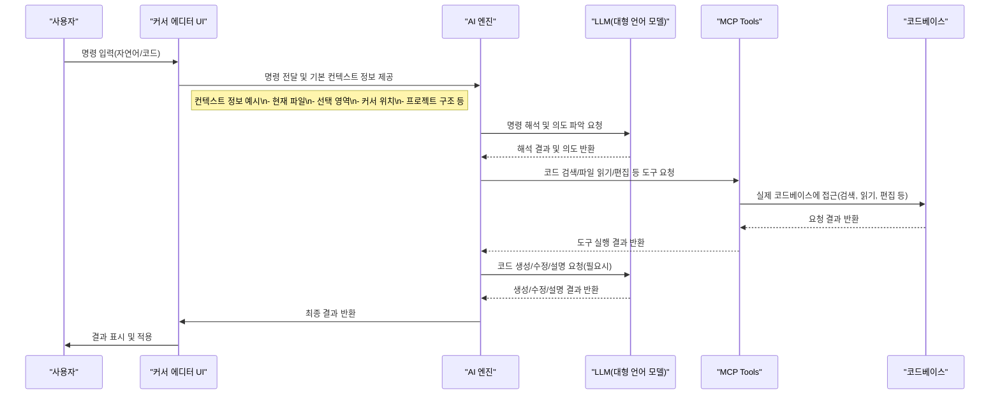

# 커서 AI 시퀀스 다이어그램

> **참고:** AI 엔진은 커서 에디터 내부(또는 확장/플러그인 형태)에서 동작하며, 커서와 긴밀하게 통합되어 있습니다. 사용자의 명령은 커서 내부의 AI 엔진으로 전달되어 해석·처리되고, 필요시 외부 LLM 및 MCP Tools와 통신하여 결과를 반환합니다.

아래는 커서 AI의 주요 동작 흐름을 나타내는 상세 시퀀스 다이어그램입니다.

