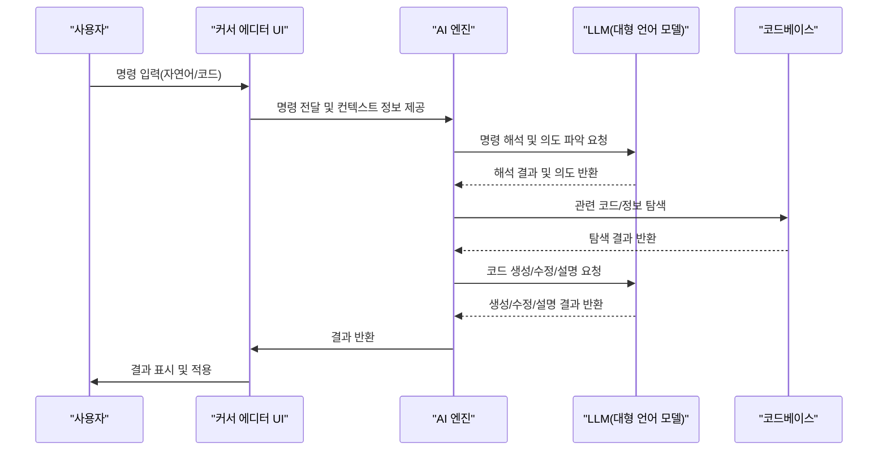

# 커서 AI 시퀀스 다이어그램

아래는 커서 AI의 주요 동작 흐름을 나타내는 시퀀스 다이어그램입니다.

```mermaid
sequenceDiagram
    participant User as "사용자"
    participant UI as "커서 에디터 UI"
    participant AI as "AI 엔진"
    participant LLM as "LLM(대형 언어 모델)"
    participant Codebase as "코드베이스"

    User->>UI: 명령 입력(자연어/코드)
    UI->>AI: 명령 전달 및 컨텍스트 정보 제공
    AI->>LLM: 명령 해석 및 의도 파악 요청
    LLM-->>AI: 해석 결과 및 의도 반환
    AI->>Codebase: 관련 코드/정보 탐색
    Codebase-->>AI: 탐색 결과 반환
    AI->>LLM: 코드 생성/수정/설명 요청
    LLM-->>AI: 생성/수정/설명 결과 반환
    AI->>UI: 결과 반환
    UI->>User: 결과 표시 및 적용
``` 